# All Club Logos

## 1. Bundesliga
### Herren
| ID | Staffel | Name | Logo | Logo 2 | Logo 3 |
|:-:|---|---|---|---|---|
| 326 | Staffel A | Rot-Weiß Köln | 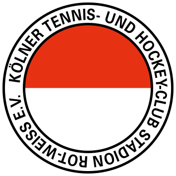 | | |
| 149 | Staffel A | Berliner HC | 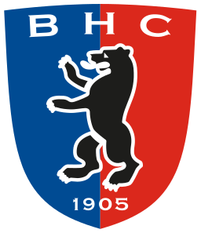 | | |
| 278 | Staffel A | Hamburger Polo Club |  | | |
| 256 | Staffel A | Club an der Alster |  | | |
| 357 | Staffel A | TSV Mannheim |  | | |
| 225 | Staffel A | SC Frankfurt 1880 |  | | |
| 374 | Staffel B | Uhlenhorst Mühlheim |  | | |
| 358 | Staffel B | Mannheimer HC | 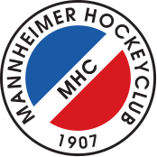| | |
| 266 | Staffel B | UHC Hamburg |  | | |
| 263 | Staffel B | Harvestehuder THC |  | | |
| 398 | Staffel B | Nürnberger HTC |  | | |
| 204 | Staffel B | Düsseldorfer HC | 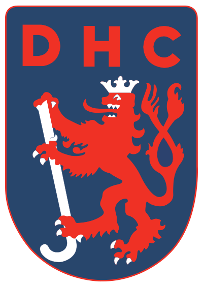 | | |

### Damen
| ID | Staffel | Name | Logo | Logo 2 | Logo 3 |
|:-:|---|---|---|---|---|
| 204 | Staffel A | Düsseldorfer HC |  | | |
| 326 | Staffel A | Rot-Weiß Köln |  | | |
| 266 | Staffel A | UHC Hamburg |  | | |
| 374 | Staffel A | Uhlenhorst Mühlheim |  | | |
| 378 | Staffel A | Münchner SC |  | | |
| 156 | Staffel A | TuS Lichterfelde |  | | |
| 358 | Staffel B | Mannheimer HC | | | |
| 256 | Staffel B | Club an der Alster |  | | |
| 263 | Staffel B | Harvestehuder THC |  | | | 
| 149 | Staffel B | Berliner HC |  | | |
| 276 | Staffel B | Großflottbeker THGC | 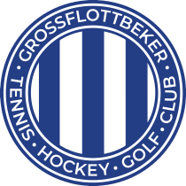 | | |
| 196 | Staffel B | Club Raffelberg |  | | |

## 2. Bundesliga
### Herren
| ID | Gruppe | Name | Logo | Logo 2 | Logo 3 |
|:-:|---|---|---|---|---|
| 276 | Nord | Großflottbeker THGC |  | | |
| 333 | Nord | Crefelder HTC |  | | |
| 327 | Nord | Blau-Weiß Köln |  | | |
| 391 | Nord | Schwarz-Weiß Neuss | 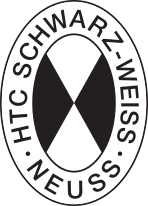 | | |
| 371 | Nord | Gladbacher HTC |  | | |
| 203 | Nord | DSD Düsseldorf |  | | |
| 325 | Nord | Schwarz-Weiß Köln | 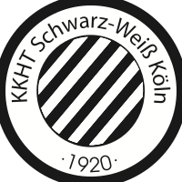 | | |
| 328 | Nord | Marienburger SC |  | | |
| 267 | Nord | Klipper THC Hamburg |  | | |
| 286 | Nord | DHC Hannover |  | | |
| 274 | Nord | THK Rissen |  | | |
| 162 | Nord | Bonner THV |  | | |
| 378 | Süd | Münchner SC |  | | |
| 349 | Süd | HC Ludwigsburg | 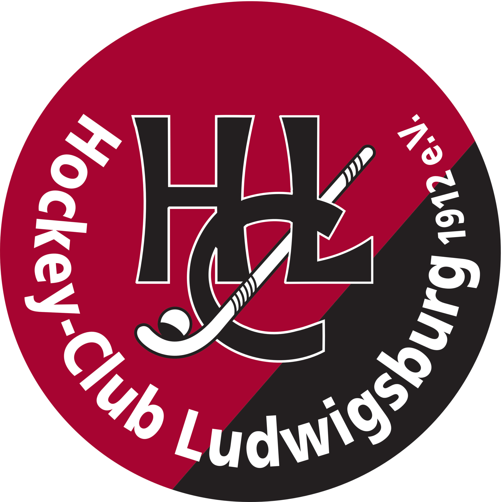 | | |
| 233 | Süd | TG Frankenthal |  | | |
| 453 | Süd | HTC Stuttgarter Kickers |  | | |
| 151 | Süd | Zehlendorfer Wespen |  | | |
| 156 | Süd | TuS Lichterfelde |  | | |
| 153 | Süd | TC Blau-Weiß Berlin |  | | |
| 396 | Süd | HG Nürnberg |  | | |
| 155 | Süd | Berliner SC | 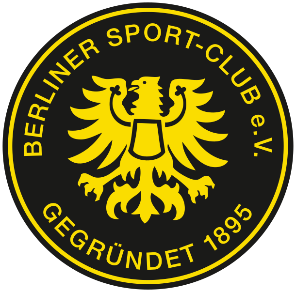 | | |

### Damen
| ID | Gruppe | Name | Logo | Logo 2 | Logo 3 |
|:-:|---|---|---|---|---|
| 170 | Nord | Bremer HC |  | | |
| 168 | Nord | Eintracht Braunschweig |  | | |
| 333 | Nord | Crefelder HTC |  | | |
| 162 | Nord | Bonner THV |  | | |
| 278 | Nord | Hamburger Polo Club |  | | |
| 258 | Nord | TG Heimfeld |  | | |
| 327 | Nord | Blau-Weiß Köln |  | | |
| 267 | Nord | Klipper THC Hamburg |  | | |
| 218 | Nord | ETUF Essen | 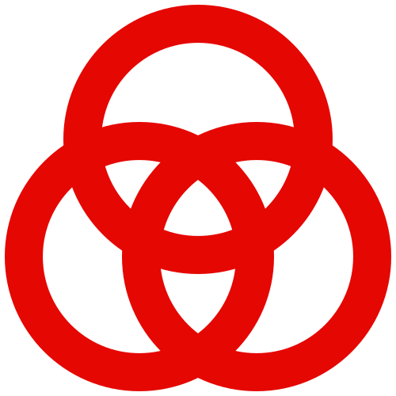 | | |
| 203 | Nord | DSD Düsseldorf |  | | |
| 427 | Süd | Rüsselsheimer RK |  | | |
| 151 | Süd | Zehlendorfer Wespen |  | | |
| 357 | Süd | TSV Mannheim |  | | |
| 398 | Süd | Nürnberger HTC |  | | |
| 159 | Süd | Bietigheimer HTC |  | | |
| 551 | Süd | Feudenheimer HC | 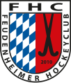 | | |
| 355 | Süd | TSV Schott Mainz |  | | |
| 153 | Süd | TC Blau-Weiß Berlin |  | | |
| 379 | Süd | TuS C Obermenzing |  | | |
| 396 | Süd | HG Nürnberg |  | | |
| 342 | Süd | ATV Leipzig |  | | |

## Regionalliga
### Herren
| ID | Gruppe | Name | Logo | Logo 2 | Logo 3 |
|:-:|---|---|---|---|---|
| 166 | Nord | Braunschweiger THC | 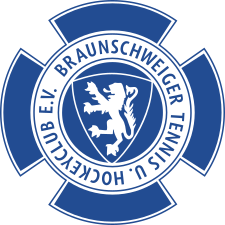 | | |
| 169 | Nord | Club zur Vahr | 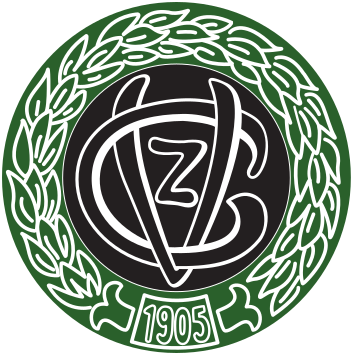 | | |
| 258 | Nord | TG Heimfeld |  | | |
| 260 | Nord | Rahlstedter HTC |  | | |
| 263 | Nord | Harvestehuder THC 2 |  | | |
| 266 | Nord | Uhlenhorster HC 2 |  | | |
| 289 | Nord | DTV Hannover |  | | |
| 479 | Nord | TTK Sachsenwald |  | | |
| 101 | West | Aachener HC | 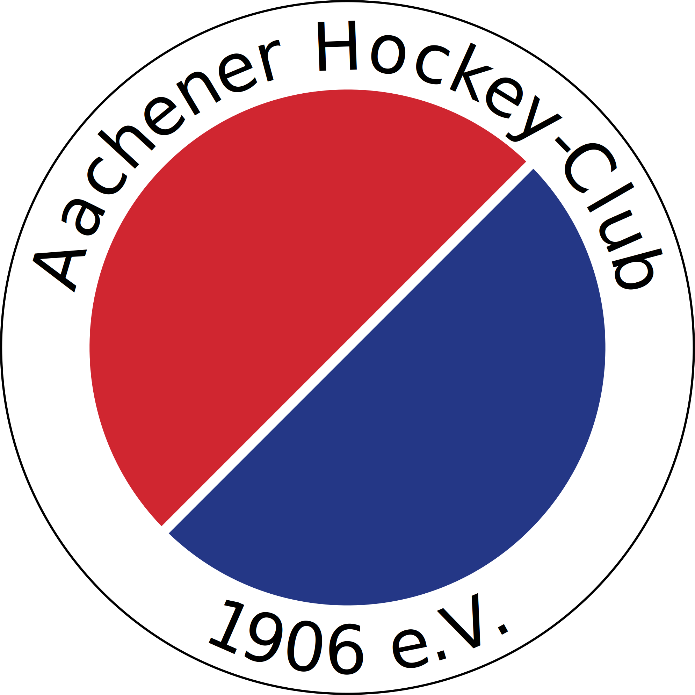 | | |
| 196 | West | Club Raffelberg |  | | |
| 218 | West | ETUF Essen |  | | |
| 220 | West | HC Essen 99 |  | | |
| 344 | West | RTHC Leverkusen |  | | |
| 374 | West | Uhlenhorst Mühlheim 2 |  | | |
| 375 | West | Kahlenberger HTC |  | | |
| 399 | West | Oberhausener THC |  | | |
| 131 | Ost | Mariendorfer HC |  | | |
| 149 | Ost | Berliner HC 2 |  | | |
| 127 | Ost | SG Rotation Prenzlauer Berg |  | | |
| 147 | Ost | SC Charlottenburg |  | | |
| 253 | Ost | TSV Leuna |  | | |
| 364 | Ost | SV Motor Meerane |  | | |
| 405 | Ost | Osternienburger HC |  | | |
| 504 | Ost | SSC Jena | 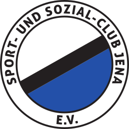 | | |
| 184 | Süd | TEC Darmstadt |  | | |
| 282 | Süd | 1. Hanauer THC |  | | |
| 346 | Süd | Limburger HC |  | | |
| 355 | Süd | TSV Schott Mainz |  | | |
| 379 | Süd | TuS C Obermenzing |  | | |
| 476 | Süd | Wiesbadener THC |  | | |
| 486 | Süd | HTC Würzburg |  | | |
| 551 | Süd | Feudenheimer HC |  | | |
| 202 | Süd 2 - West  | Dürkheimer HC |  | | |
| 225 | Süd 2 - West | SC Frankfurt 1880 |  | | |
| 228 | Süd 2 - West | SC SAFO Frankfurt |  | | |
| 229 | Süd 2 - West | TGS Vorwärts Frankfurt |  | | |
| 359 | Süd 2 - West | VfL Marburg |  | | |
| 427 | Süd 2 - West  | Rüsselsheimer RK |  | | |
| 443 | Süd 2 - West  | TFC Ludwigshafen |  | | |
| 482 | Süd 2 - West  | TG Worms |  | | |
| 160 | Süd 2 - Ost | SV Böblingen |  | | |
| 216 | Süd 2 - Ost | TB Erlangen |  | | |
| 294 | Süd 2 - Ost | HC Heidelberg |  | | |
| 357 | Süd 2 - Ost | TSV Mannheim 2 |  | | |
| 358 | Süd 2 - Ost | Mannheimer HC 2 | | | |
| 378 | Süd 2 - Ost | Münchner SC 2 |  | | |
| 381 | Süd 2 - Ost | HLC RW München |  | | |
| 382 | Süd 2 - Ost | Wacker München |  | | |

### Damen
| ID | Gruppe | Name | Logo | Logo 2 | Logo 3 |
|:-:|---|---|---|---|---|
| 169 | Nord | Club zur Vahr |  | | |
| 256 | Nord | Club an der Alster 2 |  | | |
| 259 | Nord | Marienthaler THC |  | | |
| 263 | Nord | Harvestehuder THC 2 |  | | |
| 266 | Nord | Uhlenhorster HC 2 |  | | |
| 286 | Nord | DHC Hannover |  | | |
| 293 | Nord | Hannover 78 |  | | |
| 323 | Nord | 1. Kieler HTC |  | | |
| 125 | West | THC Bergisch Gladbach |  | | |
| 193 | West | Eintracht Dortmund |  | | |
| 204 | West | Düsseldorfer HC 2 |  | | |
| 220 | West | HC Essen 99 |  | | |
| 326 | West | Rot-Weiss Köln 2 |  | | |
| 344 | West | RTHC Leverkusen |  | | |
| 374 | West | Uhlenhorst Mühlheim 2 |  | | |
| 375 | West | Kahlenberger HTC |  | | |
| 127 | Ost | SG Rotation Prenzlauer Berg |  | | |
| 131 | Ost | Mariendorfer HC |  | | |
| 133 | Ost | Steglitzer TK |  | | |
| 147 | Ost | SC Charlottenburg |  | | |
| 149 | Ost | Berliner HC 2 |  | | |
| 155 | Ost | Berliner SC |  | | |
| 364 | Ost | SV Motor Meerane |  | | |
| 405 | Ost | Osternienburger HC |  | | |
| 222 | Süd | SB DJK Rosenheim |  | | |
| 225 | Süd | SC Frankfurt 1880 |  | | |
| 228 | Süd | SC SAFO Frankfurt |  | | |
| 230 | Süd | Eintracht Frankfurt |  | | |
| 233 | Süd | TG Frankenthal |  | | |
| 282 | Süd | 1. Hanauer THC |  | | |
| 377 | Süd | ESV München |  | | |
| 453 | Süd | HTC Stuttgarter Kickers |  | | |