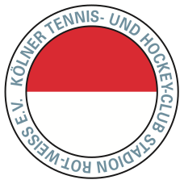
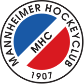
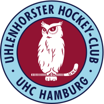
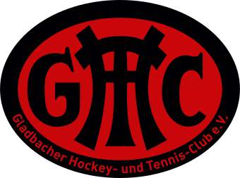
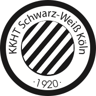
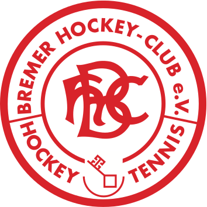

# All Club Logos

## 1. Bundesliga
### Herren
| ID | Staffel | Name | Logo | Logo 2 | Logo 3 |
|:-:|---|---|---|---|---|
| 326 | Staffel A | Rot-Weiß Köln |  | | |
| 149 | Staffel A | Berliner HC |  | | |
| 278 | Staffel A | Hamburger Polo Club |  | | |
| 256 | Staffel A | Club an der Alster |  | | |
| 357 | Staffel A | TSV Mannheim |  | | |
| 225 | Staffel A | SC 1880 Frankfurt |  | | |
| 374 | Staffel B | Uhlenhorst Mühlheim |  | | |
| 358 | Staffel B | Mannheimer HC | | | |
| 266 | Staffel B | UHC Hamburg |  | | |
| 263 | Staffel B | Harvestehuder THC |  | | |
| 398 | Staffel B | Nürnberger HTC |  | | |
| 204 | Staffel B | Düsseldorfer HC |  | | |

### Damen
| ID | Staffel | Name | Logo | Logo 2 | Logo 3 |
|:-:|---|---|---|---|---|
| 204 | Staffel A | Düsseldorfer HC |  | | |
| 326 | Staffel A | Rot-Weiß Köln |  | | |
| 266 | Staffel A | UHC Hamburg |  | | |
| 374 | Staffel A | Uhlenhorst Mühlheim |  | | |
| 378 | Staffel A | Münchner SC |  | | |
| 156 | Staffel A | TuS Lichterfelde |  | | |
| 358 | Staffel B | Mannheimer HC | | | |
| 256 | Staffel B | Club an der Alster |  | | |
| 263 | Staffel B | Harvestehuder THC |  | | | 
| 149 | Staffel B | Berliner HC |  | | |
| 276 | Staffel B | Großflottbeker THGC |  | | |
| 196 | Staffel B | Club Raffelberg |  | | |

## 2. Bundesliga
### Herren
| ID | Gruppe | Name | Logo | Logo 2 | Logo 3 |
|:-:|---|---|---|---|---|
| 276 | Nord | Großflottbeker THGC |  | | |
| 333 | Nord | Crefelder HTC |  | | |
| 327 | Nord | Blau-Weiß Köln |  | | |
| 391 | Nord | Schwarz-Weiß Neuss |  | | |
| 371 | Nord | Gladbacher HTC |  | | |
| 203 | Nord | DSD Düsseldorf |  | | |
| 325 | Nord | Schwarz-Weiß Köln |  | | |
| 328 | Nord | Marienburger SC |  | | |
| 267 | Nord | Klipper THC Hamburg |  | | |
| 286 | Nord | DHC Hannover |  | | |
| 274 | Nord | THK Rissen |  | | |
| 162 | Nord | Bonner THV |  | | |
| 378 | Süd | Münchner SC |  | | |
| 349 | Süd | HC Ludwigsburg |  | | |
| 233 | Süd | TG Frankenthal |  | | |
| 453 | Süd | HTC Stuttgarter Kickers |  | | |
| 151 | Süd | Zehlendorfer Wespen |  | | |
| 156 | Süd | TuS Lichterfelde |  | | |
| 153 | Süd | TC Blau-Weiß Berlin |  | | |
| 396 | Süd | HG Nürnberg |  | | |
| 155 | Süd | Berliner SC |  | | |

### Damen
| ID | Gruppe | Name | Logo | Logo 2 | Logo 3 |
|:-:|---|---|---|---|---|
| 170 | Nord | Bremer HC |  | | |
| 168 | Nord | Eintracht Braunschweig |  | | |
| 333 | Nord | Crefelder HTC |  | | |
| 162 | Nord | Bonner THV |  | | |
| 278 | Nord | Hamburger Polo Club |  | | |
| 258 | Nord | TG Heimfeld |  | | |
| 327 | Nord | Blau-Weiß Köln |  | | |
| 267 | Nord | Klipper THC Hamburg |  | | |
| 218 | Nord | ETUF Essen |  | | |
| 203 | Nord | DSD Düsseldorf |  | | |
| 427 | Süd | Rüsselsheimer RK |  | | |
| 151 | Süd | Zehlendorfer Wespen |  | | |
| 357 | Süd | TSV Mannheim |  | | |
| 398 | Süd | Nürnberger HTC |  | | |
| 159 | Süd | Bietigheimer HTC |  | | |
| 551 | Süd | Feudenheimer HC |  | | |
| 355 | Süd | TSV Schott Mainz |  | | |
| 153 | Süd | TC Blau-Weiß Berlin |  | | |
| 379 | Süd | TuS C Obermenzing |  | | |
| 396 | Süd | HG Nürnberg |  | | |
| 342 | Süd | ATV Leipzig |  | | |