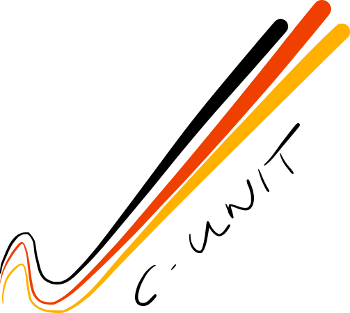
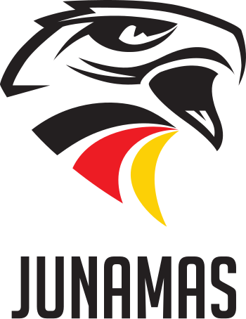
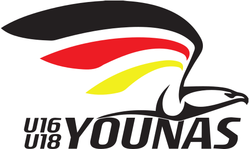

# All National Team Logos

| ID | Name | Logo |
|:-:|---|---|
| HA | Honamas |  |
| DA | Danas |  |
| MU21 | MU21 |  |
| WU21 | C-Unit |   |
| MU18 | Junamas |  |
| WU18 | Younas |   |
| MU16 | Junamas |  |
| WU16 | Younas |  |
